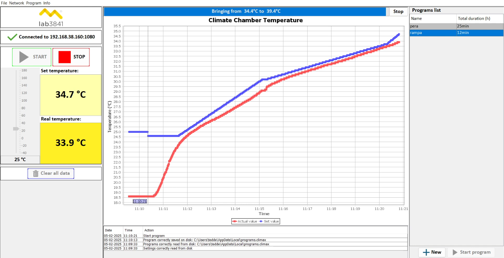
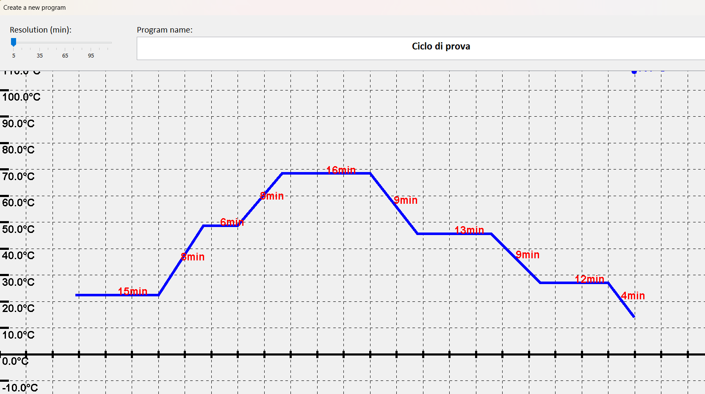
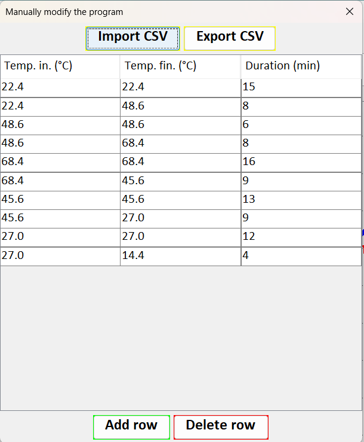

# climax
## _Control and design temperature cycles for CTS climate chambers_

---

**climax** is a Java application designed to **create**, **launch**, and **monitor** temperature cycles in CTS climate chambers over an **Ethernet connection**.

## Features

- Create and launch **custom temperature cycles**
- Real-time **temperature monitoring**
- **Graphical interface** for intuitive control
- Manual and graphical cycle programming
- Export data to **CSV** format

## Requirements

- Java **8.0** or higher
- Ethernet connection to CTS climate chamber
- Set **IP address** and **port** from the **"Network"** menu

## Main Interface

The main interface displays a real-time **temperature graph**:
- 🔴 Red: Current internal temperature
- 🔵 Blue: Desired temperature

Users can manually set a target temperature directly using the left-hand control panel. To create a new custom cycle, click the **"New"** button located in the bottom-left corner.

## Cycle Editor

This opens the **cycle editor**, where users can draw the desired temperature profile:
- **X-axis**: Time (minutes)
- **Y-axis**: Temperature (°C)

For precise control, users can also modify the data manually by clicking the **"Manually Modify"** button.

## Manual Editing

In this view, users can either fill the temperature-time table manually or **import data** from a `.csv` file. Once the cycle is saved, it can be started from the main interface using the **"Start Program"** button.

## Data Export

All temperature data can be **exported to CSV format** from the **"File"** menu.

---

## License

MIT License

---
